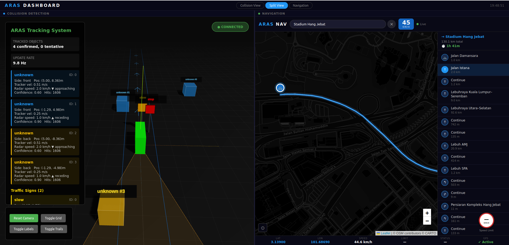

# Aras - Advanced Rider Assistance System



Aras is an Advanced Rider Assistance System (ARAS) designed to improve motorcycle safety through multi-sensor fusion. By combining data from cameras, radars, and IMUs, it provides real-time collision warnings, spatial awareness, and navigation tracking in a unified 3D Bird's-Eye-View (BEV) environment.

---

## 🌟 Key Features

### 1. Multi-Sensor Fusion
- **Camera Object Detection**: Utilizes YOLOv5 on an NPU to detect vehicles, pedestrians, and traffic signs in real-time.
- **Dual Radar Tracking**: Front and rear mmWave radars provide highly accurate distance and velocity measurements (Doppler effect) independent of lighting conditions.
- **IMU Tilt Correction**: Dynamically accounts for the motorcycle's lean angle (roll) and acceleration/braking tilt (pitch) to maintain an accurate world map.

### 2. Intelligent Threat Detection
- **Time-To-Collision (TTC) Calculation**: Evaluates the closing speed of targets rather than just static distance, providing smarter and earlier warnings for fast-approaching hazards.
- **Corridor Monitoring**: Filters out irrelevant objects (e.g., parked cars) by analyzing a strictly defined lane corridor ahead of and behind the bike.

### 3. Real-Time Haptic & Audio Feedback
- **Directional Haptics**: Left and right haptic vibrators mounted on the handlebars pulse to indicate the direction and urgency of an impending threat.
- **Dynamic Actuation**: Haptic intensity scales linearly with the proximity and speed of the incoming collision threat.
- **Audio Warnings**: Triggers distinct Forward Collision Warnings (FCW) and Rear Collision Warnings (RCW) through an onboard speaker system.

### 4. 3D Web Visualization
- Features a WebSocket-driven web dashboard displaying a top-down, 3D Bird's-Eye-View (BEV) of the bike's surroundings.
- Tracks tentatively identified objects, highlights active collision threats in red, and maintains historical object trails to visualize trajectories.
- 🔗 **[Read the full Visualization Dashboard Guide here](./system/app/README.md)**

---

## 🛠 Hardware & Setup

### Radxa Object Detection Setup
To build and install the AI SDK for object detection on the Radxa platform:
```bash
# quantisize (got to dir ai-sdk/examples/vpm_run)
make AI_SDK_PLATFORM=a733
make install AI_SDK_PLATFORM=a733 INSTALL_PREFIX=./
# export and allow permission
export LD_LIBRARY_PATH=$LD_LIBRARY_PATH:/home/radxa/Documents/Aras/low_level/modules/ai-sdk/viplite-tina/lib/aarch64-none-linux-gnu/v2.0
chmod +x ./yolov5
```

### Software Dependencies
Install the required Python packages:
```bash
pip install -r requirements.txt
```

---

## 📐 BEV Coordinate System Calibration

To accurately project 2D camera bounding boxes onto a 3D world plane, you must configure the camera's extrinsic parameters in `config.yaml`:

```yaml
bev:
  image_pts: [[10, 20], [60, 20], [60, 40], [10, 40]]  # bbox corners in pixels (x, y)
  world_pts: [[0, 2], [0.5, 2], [0.5, 1.5], [0, 1.5]]  # real positions in metres (x, y)
```

**How to measure these points:**
1. Mount the camera on the bike in its final position.
2. Find a visible rectangular region on the ground (e.g., a parking box).
3. Find the exact `(x, y)` pixel coordinates of the 4 corners of that rectangle in the image. These become your `image_pts`.
4. Measure the physical real-world distance to those 4 corners relative to your bike. 
   - **World Coordinate System**: 
     - Origin `(0,0)` is the camera/bike.
     - The **Y-axis is forward** (depth). Positive Y means straight ahead in front of the bike.
     - The **X-axis is lateral** (left/right). `0` is center. Positive X is to the right, negative X is to the left.
   - Example: If a corner is exactly 2 meters straight ahead of the camera, its world point is `[0, 2.0]`. If it is 2 meters ahead and 0.5 meters to the right, it is `[0.5, 2.0]`.

*(Optional)* Calibrate the intrinsic camera matrix using a checkerboard:
```python
from BEV import calibrate_camera
import glob
K, dist, rms = calibrate_camera(
    image_paths=glob.glob('calib/*.jpg'),
    board_size=(9, 6),
    square_size_m=0.025,
)
print('Camera matrix:\n', K)
print('RMS reprojection error:', rms)
```

---

## 🧠 System Algorithms and Mathematics

### 1. Inverse Perspective Mapping (IPM) & IMU Tilt Correction
The camera inherently captures a 2D perspective projection of the 3D world. To estimate distances and fuse camera data with radar, we must transform pixel coordinates $(u, v)$ into a top-down metric Bird's-Eye-View (BEV) $(x, y)$. We use **Homography** and dynamic **IMU pitch/roll correction**.

Given an intrinsic camera matrix $K$:
$$K = \begin{bmatrix} f_x & 0 & c_x \\ 0 & f_y & c_y \\ 0 & 0 & 1 \end{bmatrix}$$

First, we compute the tilt rotation matrix $R$ from the IMU's accelerometer gravity vector:
$$\theta_{roll} = \arctan2(a_y, a_z), \quad \theta_{pitch} = \arctan2(-a_x, a_z)$$
$$R = R_x(\theta_{pitch}) R_y(\theta_{roll})$$

To dynamically "un-tilt" the camera pixels caused by the bike leaning or accelerating, we compute a per-frame homography $H_{tilt}$:
$$H_{tilt} = K R K^{-1}$$
We project a bounding box's bottom-center pixel $p_{img} = [u, v, 1]^T$ through $H_{tilt}$, and then apply the base ground-plane Homography $H_{ground}$ (calibrated via the `image_pts` and `world_pts` in `config.yaml`):
$$p_{level} = H_{tilt} \cdot p_{img}$$
$$p_{world} = H_{ground} \cdot p_{level}$$
This yields the final $(x, y)$ position in metres on the flat ground plane.

### 2. Multi-Object Tracking & Kalman Filtering
The `TrackManager` tracks detected objects over time using a **Constant Velocity Kalman Filter** to estimate position and velocity, and to predict locations when detections are briefly lost.

The state vector is $x_k = [x, y, v_x, v_y]^T$.
**Prediction Step (Constant Velocity Model):**
$$x_{k|k-1} = F x_{k-1|k-1}$$
$$P_{k|k-1} = F P_{k-1|k-1} F^T + Q$$
Where $F$ is the state transition matrix for time step $\Delta t$:
$$F = \begin{bmatrix} 1 & 0 & \Delta t & 0 \\ 0 & 1 & 0 & \Delta t \\ 0 & 0 & 1 & 0 \\ 0 & 0 & 0 & 1 \end{bmatrix}$$

**Update Step:**
We observe the position $z_k = [x, y]^T$, so the measurement matrix is $H = \begin{bmatrix} 1 & 0 & 0 & 0 \\ 0 & 1 & 0 & 0 \end{bmatrix}$.
$$y_k = z_k - H x_{k|k-1}$$
$$S_k = H P_{k|k-1} H^T + R$$
$$K_k = P_{k|k-1} H^T S_k^{-1}$$
$$x_{k|k} = x_{k|k-1} + K_k y_k$$

### 3. Sensor Fusion (Hungarian Matching)
At every frame, the new list of detections must be assigned to the existing Kalman Filter tracks. We solve this using the **Hungarian Algorithm** (Linear Sum Assignment) to minimize the global Euclidean distance cost between predicted track positions and new detection positions.

Let $T$ be the set of existing tracks and $D$ be the set of new detections. We compute a cost matrix $C$ where:
$$C_{i,j} = \sqrt{(x_{T_i} - x_{D_j})^2 + (y_{T_i} - y_{D_j})^2}$$
The Hungarian algorithm finds the optimal binary assignment matrix $X$ that minimizes the total cost $\sum C_{i,j} X_{i,j}$. Matches exceeding a threshold `max_distance` (e.g., 2.0 metres) are rejected, ensuring tracks don't jump erratically. 
When radar data is available, the Kalman Filter's $v_y$ velocity state is nudged (Alpha filter) toward the highly-accurate doppler radar velocity.

### 4. Time-To-Collision (TTC) & Auto-Braking Actuation
To trigger warnings, we use **Time-To-Collision (TTC)** instead of raw distance, which accounts for the closing speed of approaching vehicles.

For an object tracked at longitudinal distance $y$ with relative longitudinal velocity $v_y$:
$$TTC = \frac{|y|}{|v_y|}$$
(Only calculated if the object is in the immediate front corridor $|x| < \text{LANE\_HALF\_WIDTH}$ and is approaching the bike $v_y < 0$).

If $TTC < TTC\_THRESHOLD$ (e.g., 2.0 seconds), a collision alert is generated. 

**Haptic Feedback:**
The haptic feedback intensity scales dynamically based on the urgency:
$$\text{Intensity} = \min\left(1.0, \text{Confidence} \times \frac{TTC\_THRESHOLD}{\max(TTC, 0.1)}\right)$$

**Auto-Braking Logic:**
The physical brake actuator will only be triggered to fire if the motorcycle's current speed (measured via the onboard GPS) is within a safe operational envelope. For example:
$$5.0 \text{ km/h} \leq \text{Ego Speed} \leq 50.0 \text{ km/h}$$
This prevents the system from locking the brakes at dangerous highway speeds, or constantly triggering when rolling through a tight parking lot.

---

## 5. Configuration & Fine-Tuning
The ARAS system relies on several global parameters that must be empirically fine-tuned during real-world testing and validation. These parameters are exposed as global constants at the top of their respective implementation files.

**Tracker Parameters (`system/tracker.py`):**
- `KALMAN_PROCESS_NOISE_Q` & `KALMAN_MEASURE_NOISE_R`: Tune these based on the physical vibration of the motorcycle and the inherent spatial noise of the sensors. Higher $R$ means trusting the sensor measurement less and relying more on the prediction model.
- `TRACK_MAX_DISTANCE`: The maximum allowed spatial jump (in meters) between frames for a detection to match an existing track. Tune based on expected max target speeds and the system's operational frame rate.
- `TRACK_CONFIRM_HITS` & `TRACK_DELETE_MISSES`: Adjust to balance track stability against ghost detections. Higher required hits reduce false positives but increase detection latency.

**System & Fusion Parameters (`system/system.py`):**
- `FUSION_MATCH_DIST`: The spatial threshold (in meters) to consider a camera bounding box and a radar point as the same physical object.
- `RADAR_VELOCITY_ALPHA`: Controls how aggressively the Kalman filter's velocity is overwritten by the radar's Doppler speed.
- `LANE_HALF_WIDTH`: The physical width of the threat corridor. Widen this for city driving, narrow it for lane-splitting scenarios.
- `TTC_THRESHOLD`: The critical Time-To-Collision (in seconds) before triggering the haptic/audio actuators.
