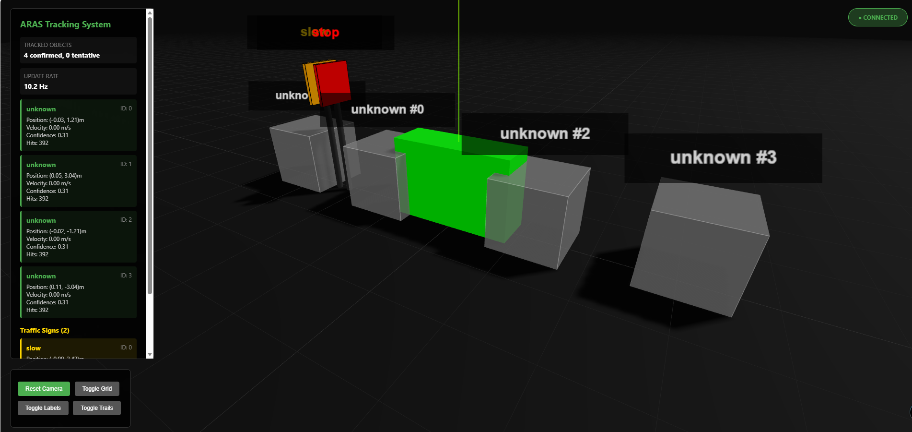
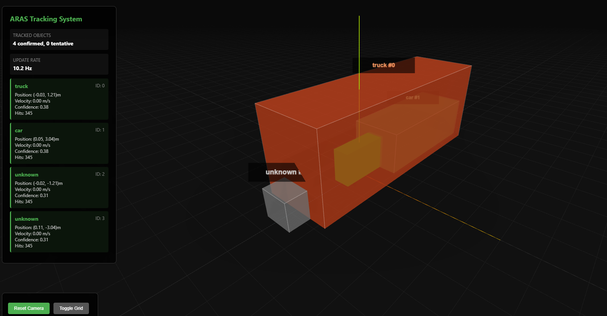

# ARAS Visualization Dashboard





The ARAS Visualization Dashboard is a real-time, browser-based 3D Bird's-Eye-View (BEV) rendering of the environment tracked by the Advanced Rider Assistance System. It is built using Three.js and connects directly to the system's WebSocket server to visualize objects, speeds, collision statuses, and historical tracking trails.

## 🌟 Key Features

- **Live 3D Rendering (Three.js)**: Full 3D environment with free-camera OrbitControls (pan, zoom, rotate).
- **Dynamic Object Styling**:
  - 🔵 **Blue**: Neutral objects in front of the bike.
  - 🟡 **Yellow**: Objects located behind the bike.
  - 🟣 **Purple**: Highly vulnerable human classes (e.g., pedestrians, cyclists) with a visual "halo" effect.
  - 🔴 **Red (Flashing)**: Active collision threats violating the Time-To-Collision (TTC) threshold.
  - **Translucency**: Ghosted (translucent) objects indicate "tentative" tracks that are still being verified by the Kalman Filter, while solid objects denote "confirmed" tracks.
- **Traffic Sign Recognition**: Renders identified traffic signs (Stop, Slow, Speed Limits) as physical 3D signs on poles along the roadway.
- **Object Trajectory Trails**: A toggleable feature that draws a colored line path tracing the historical movement of an object.
- **Diagnostic Information Panel**: An on-screen UI overlay displaying:
  - Total confirmed and tentative track counts.
  - Live system update frequency (Hz).
  - Individual object breakdowns including assigned IDs, positions, radar/tracker velocities, and confidence scores.

## ⚙️ How it Works
The frontend establishes a connection via `ws://localhost:8765`. On every update tick from the backend:
1. **Tracks & Signs**: Data packets are parsed to extract world positions, object classes, and calculated statuses (e.g., `front_collision`, `back_collision`).
2. **Dynamic Configuration**: At connection, the frontend receives a `config` payload containing the size dimensions for different classes (`car`, `truck`, `pedestrian`, etc.) as defined in `system/config.yaml`.
3. **Mesh Updates**: The Three.js scene graph creates, updates, or deletes 3D bounding boxes and sprites matching the exact metric sizes and distances computed by the backend.

- **BEV Coordinates**: $(x, y)$ where $+y$ is forward, $+x$ is right.
- **Three.js Mapping**: 
  - $x \rightarrow x$ (right)
  - $y \rightarrow$ height
  - $z \rightarrow -y$ (forward, negated for Three.js convention)
- **Origin**: Ego vehicle (bike) at $(0, 0, 0)$.

## 🚀 Usage

### 1. Install Dependencies
```bash
pip install websockets
```

### 2. Configure Sizes
If you wish to change the size or color of an object or sign rendered in the visualization, edit the respective properties under `class_dimensions` and `sign_dimensions` in the root `system/config.yaml` file. The frontend will dynamically inherit these changes.

### 3. Run the System
From the `system` directory:
```bash
python system.py
```

This will:
- Start the ARAS tracking system.
- Launch the WebSocket server on `ws://localhost:8765`.
- Begin streaming tracking data.

### 4. Open Visualization
**Option A: Local PC Viewing**
Simply open `system/app/index.html` in any modern web browser (double-click or drag to browser). 
Use the UI buttons on the bottom-left to toggle grid lines, object labels, and tracking trails.

**Option B: Mobile Hotspot Viewing (Accessing from Phone)**
If you are running the system on a device (e.g., Radxa/Raspberry Pi) connected to your phone's mobile hotspot, you can view the dashboard directly on your phone's browser!

1. **Serve the HTML file**: In a new terminal window, navigate to the `system/app` directory and start a simple Python HTTP server:
   ```bash
   cd system/app
   python -m http.server 8080
   ```
2. **Find the IP Address**: Find the IP address assigned to your bike's device by your phone's hotspot. You can usually find this in your phone's "Hotspot/Tethering" settings under connected devices, or by running `hostname -I` or `ip addr` on the device itself. (e.g., `192.168.43.55`).
   ```bash
   sudo ufw allow 8080/tcp  # For the HTML server
   sudo ufw allow 8765/tcp  # For the WebSocket server
   ```
3. **Open on Phone**: Open Chrome/Safari on your phone and navigate to:
   ```text
   http://192.168.43.55:8080
   ```
   *Note: Because the WebSocket server binds to `0.0.0.0` and the HTML file dynamically checks `window.location.hostname`, the dashboard will automatically connect to the real-time data stream over the LAN.*
